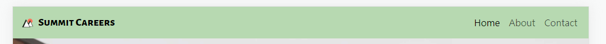
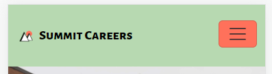
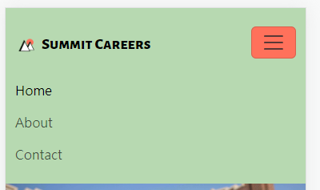
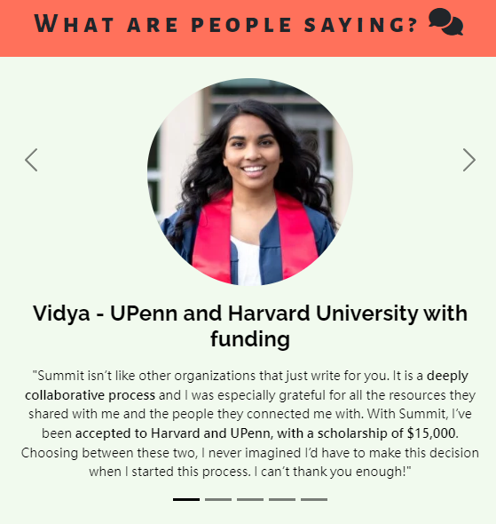
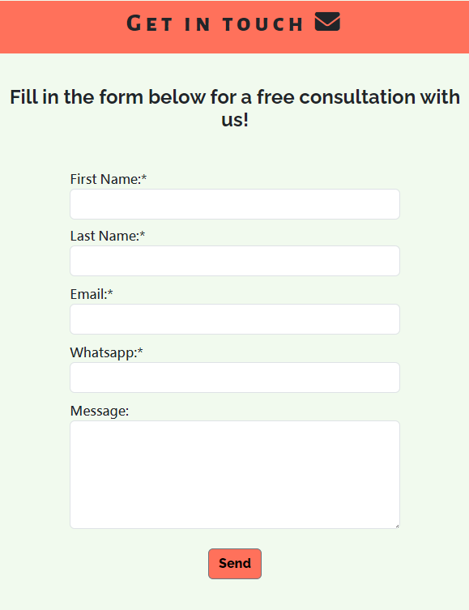
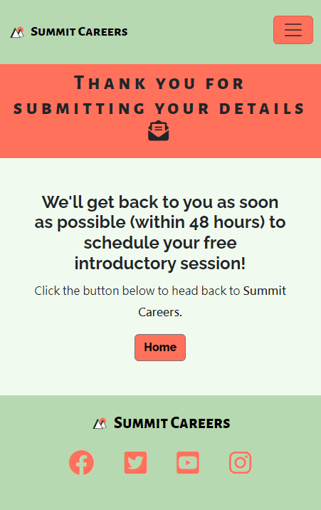
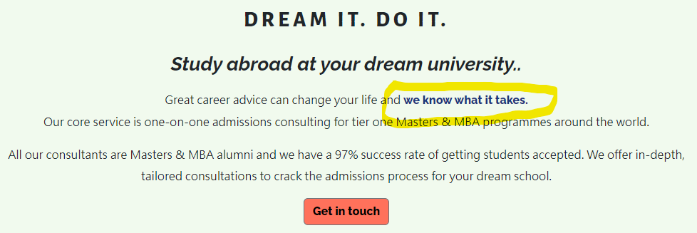
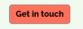

# Summit Careers 🚀 

This is an existing website run by my friend which advertises the admissions consulting services offered by [**Summit Careers**](https://www.careerswithsummit.com). Since the website is due to be refurbished and updated soon, I spoke with the Founder of Summit Careers and offered to design a potential new look for the page.

The purpose of the website is to attract prospective MBA and Masters students seeking guidance and support while applying for their dream college or university abroad. The key aims are to give details of the company services and encourage users to submit their details for more information / to schedule a meeting with the team.

## Showcase

The **Am I Responsive?** link can be found here - [Am I Responsive?](https://ui.dev/amiresponsive?url=https://tarahwaters.github.io/milestone-project1/)

A **deployed link** to the live website can be found here [Summit Careers MS1 Project live site](https://tarahwaters.github.io/milestone-project1/)

---

## UX:

## Strategy

### Target Audience

Young, educated professionals (usually with around 4/5 years of work experience) looking to apply for an MBA or Masters at a competitive tier one school abroad. Although the company work remotely and can be accessed from anywhere in the world, the main audience are working professionals based in urban areas of India.

### User Requirements and Expectations

- Simple and intuitive user interface
- Smooth navigation between pages
- Information is relevant, useful and easy to find
- Social links are available and work correctly
- Clear presentation of the content
- Design that is visually attractive
- Accessibility
- Features and navigation system works as expected

### User Stories

**The user:**
- As a user I want to find out more about the services offered.
- As a user I want to find this information easily, without too many clicks needed.
- As a user I want to know the experience level of the consulting team and their backgrounds.
- As a user I want to be reassured that the team are trustworthy, have a positive reputation and a track record of successful candidates.
- As a user I want to get in touch with the company easily and securely, without needing to commit or pay anything upfront.
- As a user I want to be able to find the company contact details and social links easily
- As a user I want reassurance that my enquiry will be answered quickly and the process is straight-forward.
- As a user I want to the option of opting in / out of receiving newsletters and advice by email when submitting my details.
- As a user I want to view this information smoothly on preferably either a mobile device or tablet, with the option of also a desktop.

**The site owner:**
-	As a site owner I want users to find out about our services and team
-	As a site owner I want users to submit their contact details and arrange schedule a meeting with us
-	As a site owner I want users to have the option of signing up to our newsletter for useful blog posts and advice
-	As a site owner I want users to have a good visual experience when visiting the website
-	As a site owner I want users to be able to see a 404 page if anything goes wrong
-	As a site owner I want users to feel we are a trustworthy and reliable company who offer a valuable service
-	As a site owner I want users to know the positive success we have had with other clients and the process involved when working with us

### Business Vision

Taking the exisiting website and its functionality, but attempting to **improve on the consistency of the design** to make it easier and quicker for customers to sign up. 

A **business-to-consumer (B2C)** audience is targeted so the content and visual layout needs to be simple, clear and engaging, while still keeping in line with the minimalist and modern feel of the original site.

## Trade Offs

The table below shows the features that should be implemented to make an appealing and functional website for users. Due to time constraints and my current skill level, some of these features are not implemented at this stage.

[X] indicates opportunities that were considered at the planning stage but were deemed not viable/feasible for this project sprint.
Y / N indicates a Yes / No as to whether each opportunity was acheived and implemented at this stage.

| Opportunity                                                | Importance | Viability / Feasibility | Outcome |
| ---------------------------------------------------------- | :--------: | :---------------------: | :------:|
| Form to submit details                                     |     5      |            5            |    Y    |
| Include a contact form on each page                        |     5      |            5            |    Y    |
| Include a sign up to newsletter option in contact form     |     4      |            5            |    N    |
| Contact page                                               |     5      |            5            |    Y    |
| Reviews                                                    |     5      |            5            |    Y    |
| Team member details (about page)                           |     5      |            5            |    Y    |
| Study Abroad page to detail process of service             |     4      |            4            |    N    |
| Schedule a call calendar button [X]                        |     3      |            2            |    N    |
| Option to contact via WhatsApp [X]                         |     3      |            2            |    N    |
| Blog post page [X]                                         |     3      |            1            |    N    |

## Scope

New website features to be included in this project:

- New logo and design consistent throughout website
- Contact form accessible on each page with the option to sign up for the Base Camp newsletter
- Reviews organised in a compact, clickable gallery (for mobile) / carousel

## Structure

The website consists of 5 pages (Home, About Us, Study Abroad, Reviews and Contact Us).
The pages are laid out logically so users can predict where to find thei information they need.
A contact form is avaiable at the bottom of each page to increase sign up. 

**Home** - 
There is a hero image with a brief description of the website and a strong message of company success rates. Reviews are a main focus underneath this, along with an inspiring message and a contact form.

**About Us** - 
Team member details and images are displayed. Contact form at the bottom of the page.

**Study Abroad** -
Description of the Summit consulting process along with logos of university / colleges (with links) that Summit has worked with. A selection of student reviews are also included, along with a contact form.

**Reviews** -
A gallery page of positive reviews. Contact form at the bottom.

**Contact Us** -
A separate page for the contact form only (in case the user jumps straight here from the nav bar).

**Header and Footers** -
All pages will include the same header and footer for consistency. The mobile and tablet versions will have a more basic design, with only the logo and menu icon in the corner for simplicity. Company details, copyright and social media links will be available on the footers.

## Surface

### Colour Scheme

[coolors.co](https://coolors.co/) was used to create a colour palette for the design.

I designed a new logo to also match with the themes. These were the initial colour palettes used.

Then an alternative was tested after DevTools suggested a more user friendly contrast in colors - 

### Typography

[fontjoy.com](https://fontjoy.com/) was used to create aesthetic font pairings for the webpage.

- **Alegreya Sans SC**
- **Raleway**
- **Hind Madurai**
- with a backup font of **"Sans serif"**

---

## Wireframes:

These were the initial wireframes created for the project during the planning stage:

------

## Features:

The pages of the website are as follows:

- Home page
- About page
- Contact us page (the same contact form is also included at the bottom of each page as per the client's request for maximising user engagement)
- Redirected confirmation page (after submitting form data)

### Existing Features

- **Feature #1 Nav bar**

    - The nav bar is clearly displayed at the top of each page and contains the logo / brand name (which is also a link to the Home page) and navigation links to each page of the website for easy access.

- **Feature #2 Nav bar mobile toggler**

    - The mobile nav bar toggler, accessible on smaller mobile devices, collapses the navbar into a simple menu button that when clicked can open a list of the pages of the website. This allows for a cleaner UX design which takes up less space, but provides the user with the necessary navigation options. Clicking the icon opens the menu, and clicking again can close the menu.

- **Feature #3 Hero image carousel with cover text**

    - Inpsiring graduate student and university images are displayed in a carousel that is the first section a user will see on the home page. The cover text contains an engaging and strong description of the company's success and service offered to appeal to the user straight away. The images scroll automatically but the user can also access the controls by clicking on the next/previous icons.

- **Feature #4 Review carousel**

    - A carousel with images and captions of previous clients' positive reviews is displayed on mobile devices, with previous/next control indicators to scroll through each review. This layout was made for mobiles so that all reviews are still accessible but they do not take up a huge amount of screen space. On larger screens, all reviews can be seen on a single page.

- **Feature #5 Contact form**

    - As per the client's request, a contact form is accessible on each page as well as on the Contact page. This form requires certain details from the user in order for successful submission, and will give instant feedback if they have entered any invalid details by mistake.

- **Feature #6 Redirected confirmation page**

    - Once details have been submitted successfully using the submit button, the user is redirected to a confirmation page where they are informed that their details have been submitted and will be processed within 48 hours. This gives the user reassurance and feedback after submitting the form.

- **Feature #7'we know what it takes' link to About page**

    - Similar to the original website, the phrase 'We know what it takes' is a key branding message and in this instance, if the user wants to know more about the company team, they can click the link to be directed to the About page.

- **Feature #8 'Get in touch' button link to Contact form on same page**

    - When the user clicks a 'Get in touch' button, they are instantly taken to the bottom of the page where they can submit their details and arrange a meeting with the Summit consulting team. The client was particularly happy with this feature as it increases the opportunities users have to sign up for their services and also means less navigation to get there.

- **Feature #9 Team details with images and descriptions**

    - A page with details and images of each member of the Summit consulting team and advisory board are clearly displayed here.

- **Feature #10 Footer with social links**

    - In the footer of each page there is the company logo and brand name (with a link to the homepage) and also social media link icons that have been styled with the Summit colour palette. These links potentially give the user access to the social media pages of the company where they can see more content from the company.

### Future Features

Not all the intended features were implemented at this stage of the project due to the following reasons:
    - Viability
    - Lack of knowledge / skills
    - Limited time frame for release of the project

- **Feature 1**
    - Adding a newsletter option to the contact form page
- **Feature 2**
    - Including a blog page or access to newsletter updates from a blog page
- **Feature 3**
    - A WhatsApp link to send a message directly from the web
- **Feature 4**
    - Schedule a meeting directly via an interactive calendar function
- **Feature 5**
    - Redirect page automatically returns to the homepage with a countdown

---

## Technologies Used:

- **HTML5**
- **CSS**
- **Bootstrap**

## Testing:

For all testing, please refer to the [TESTING.md](TESTING.md) file.

## Deployment:

The site was deployed to GitHub Pages. The steps to deploy are as follows:
- In the [GitHub repository](https://github.com/tarahwaters/milestone-project1), navigate to the Settings tab 
- From the source section drop-down menu, select the **Main** Branch, then click "Save".
- The page will be automatically refreshed with a detailed ribbon display to indicate the successful deployment.

The live link can be found [here](https://tarahwaters.github.io/milestone-project1)

### Local Deployment

This project can be cloned or forked in order to make a local copy on your own system.

#### Cloning

You can clone the repository by following these steps:

1. Go to the [GitHub repository](https://github.com/tarahwaters/milestone-project1) 
2. Locate the Code button above the list of files and click it 
3. Select if you prefer to clone using HTTPS, SSH, or GitHub CLI and click the copy button to copy the URL to your clipboard
4. Open Git Bash or Terminal
5. Change the current working directory to the one where you want the cloned directory
6. In your IDE Terminal, type the following command to clone my repository:
	- `git clone https://github.com/tarahwaters/milestone-project1.git`
7. Press Enter to create your local clone.

Alternatively, if using Gitpod, you can click below to create your own workspace using this repository.

Please note that in order to directly open the project in Gitpod, you need to have the browser extension installed.
A tutorial on how to do that can be found [here](https://www.gitpod.io/docs/configure/user-settings/browser-extension).

## Credits:

- [Toto Kotaro Tanaka - former CI Student github repository](https://github.com/Toto-Kotaro-Tanaka/ms1-school-of-english) - used feedback section code as a template for my Review section on the homepage (credit labelled in html)
- [Toto Kotaro Tanaka MS1 live site](https://toto-kotaro-tanaka.github.io/ms1-school-of-english/index.html)
- [jtuck15 - former CI student github repository](https://github.com/Code-Institute-Submissions/jtuck15-milestone-project-1)
- [jtuck15 MS1 live site](https://jtuck15.github.io/milestone-project-1/index.html)
- Code Institute Tutorials
- [Tim Nelson's Markdown Builder](https://traveltimn.github.io/markdown-builder/) to help create the structure and some of the content for the README and TESTING.md files

### Content

**Navbar** from [Bootstrap or BS](https://getbootstrap.com/docs/5.0/components/navbar/#responsive-behaviors) 
- adjusted bg color and added brand/logo with homepage link, moved menu items across to the right side for better UI.
- **@Nathan Parry_4P_cohort_lead** and **@Paul Treggiden** (see References for contact links) helped fix issues with styling.

**Footer** - used code from Code Institute (CI) Love Running tutorial as a reference, then adapted styling for page and used bootstrap columns to separate text and social links.
- Issues with responsiveness and text-alignment within the columns for larger screens, so contacted CI tutor support to help with this. Solution found using BS class of 'my-auto' to add auto top and bottom margins to each column which helped to center the content.
- Footer design for mobile devices was simplified using a different set of code (logo and social links only displayed using a BS row) hidden for larger screens using the 'd-lg-none' BS class.

**Hero image carousel** from [BS](https://getbootstrap.com/docs/4.0/components/carousel/#with-indicators).
- Help with carousel slides initially not showing up - [ByteGrad on YouTube](https://www.youtube.com/watch?v=mPZLxhgTKCU).
- Suggestions on how to crop height of carousel heroimage3.jpg after successfully targeting in CSS - [linuxhint](https://linuxhint.com/how-to-crop-an-image-using-css/).
Tutor support to fix hero image alignment problem - **@Paul Treggiden** identified that the problem was that the image aspect ratio was different to the others (using an aspect ratio calculator), and helped me adjust my image to a 3x2 ratio that now works well.

**Cover-text / hero image text overlay** 
- Initial code attempted using CI Love Running tutorial, adapted for personal styling.
- Then additional help sought from [stackoverlow](https://stackoverflow.com/questions/62550170/how-to-customize-the-bootstrap-carousel-to-have-some-text-static-and-some-chang) to add text within BS image carousel (since initial styling and responsiveness with a separate text overlay seemed too complicated).

**Company-summary Section** - used code from 'club-ethos' section of CI Love Running tutorial as a reference to have a header with two boxes of content underneath (for large screens), along with media query to help make the page responsive (e.g. collapsing to a single column).
- Issues with responsive styling of the two adjacent boxes (particularly with resizing the image but keeping aspect:ratio) so contacted CI tutor support for assistance. They recommended using a **'flexbox'** and this link was helpful in understanding the concept: [https://css-tricks.com/snippets/css/a-guide-to-flexbox/.](https://css-tricks.com/snippets/css/a-guide-to-flexbox/.).
- Then had further issues with the media query to account for the flexbox, which tutor support helped with again using the **'flex-direction' property** -  [https://developer.mozilla.org/en-US/docs/Web/CSS/flex-direction]( https://developer.mozilla.org/en-US/docs/Web/CSS/flex-direction) and then **ordering the flex items** was important too - [https://developer.mozilla.org/en-US/docs/Web/CSS/CSS_Flexible_Box_Layout/Ordering_Flex_Items](https://developer.mozilla.org/en-US/docs/Web/CSS/CSS_Flexible_Box_Layout/Ordering_Flex_Items).

**Bootstrap buttons** - from [BS](https://getbootstrap.com/docs/5.3/components/buttons/).
- CI CV Project tutorial was used to help with overriding BS button styling to match website colour scheme.
- [Testbook](https://testbook.com/web-development/how-to-create-an-html-button-that-acts-like-a-link) helped fix the link for the 'Get in touch' button so it redirects to the contact-form section towards the bottom of the page.

**Review Section** - another carousel was used from [BS](https://getbootstrap.com/docs/5.1/components/carousel/#dark-variant) code, this time a dark variant (so that the indicators would be more visible) with slide labels for the review quotes. 
- The carousel worked well for mobile devices with just one review visible at a time, and the option to tap or scroll across to see more. However, it felt more appropriate to have all the reviews spread acrosss the page on larger screens.
- Former CI student, [Toto Kotaro Tanaka's School of English page](https://toto-kotaro-tanaka.github.io/ms1-school-of-english/index.html) and [github repository](https://github.com/Toto-Kotaro-Tanaka/ms1-school-of-english) submitted for their MS1 project helped me massively in trying to figure out the structure and styling needed for the larger layout. Their code was used as a template which was then adapted and styled along with [BS documentation guidance on the grid system using column classes](https://getbootstrap.com/docs/4.0/layout/grid/).
- [SlackOverflow](https://stackoverflow.com/questions/14977392/bootstrap-carousel-remove-auto-slide) provided support for stopping the auto scroll of slides for BS carousels.
- @Paul Treggiden explain the 'display:block' function in CSS and how it could be used to centralise the review images, since it will then take up the entire space of the container it is in.

**Contact-form Section** - adapted code initially from CI CV and Love Running project tutorials.
- Used [MDN Web Docs](https://developer.mozilla.org/en-US/docs/Web/HTML/Element/input/tel) for help with understanding **input type="tel"** properties for the contact form.
- When adding labels to the contact form, the structure became distorted and less uniform so decided to add in some [BS form elements](https://getbootstrap.com/docs/4.0/components/forms/) for easier responsive styling.
- [SlackOverflow](https://stackoverflow.com/questions/31873595/keep-label-and-auto-sizing-input-on-the-same-line) was used to help adjust the visual layout of the name inputs, so that on larger screens the first name and last name inputs could share a row. [MDN Web Docs](https://developer.mozilla.org/en-US/docs/Web/CSS/flex-direction) gave further insight into the potential use of **flex-direction**, along with troubleshooting help from cohort peer, **@Paul Treggiden**.

**About Page** - styles utilised from homepage and structure for 'Team and Advisor Board' sections based on code used for 'Review' section (adapted BS column layout to emphasise top two team members in the larger screen layout).

### Media Content

- Photos used on the webpage came from [https://unsplash.com](https://unsplash.com/)
- Icons used came from [https://fontawesome.com/](https://fontawesome.com/)
- Wireframes were created using [Balsamiq](https://balsamiq.com/) software

### Acknowledgements

- Code Institute Tutor support
- Cohort Facilitator - [Iris Smok](https://ie.linkedin.com/in/irissmok)
- Mentor for support throughout the project
- Cohort peers and Slack community, especially:
    - [@Nathan Parry_4P_cohort_lead](https://app.slack.com/client/T0L30B202/D04ULFN551P/rimeto_profile/U04EX23NTND) support with coding advice and encouragement, help with README.md structure, ideas and useful websites  
    - [@Paul Treggiden](https://app.slack.com/client/T0L30B202/D04UYMV6WBG/rimeto_profile/U043S9PT5E1) support with coding advice and encouragement
    - [Stephen Seagrave](https://github.com/nemixu) - former CI student and tutor. MS1 guidance and access to Stephen's Milestone1 repo which was useful for inpsiration and structure when planning

## References

- Beautify code with [prettier.io](https://prettier.io/)
- Compress images with [tinypng] (https://tinypng.com/)
- Convert and resize images to new gen format WEBP using [redketchup](https://redketchup.io/)

