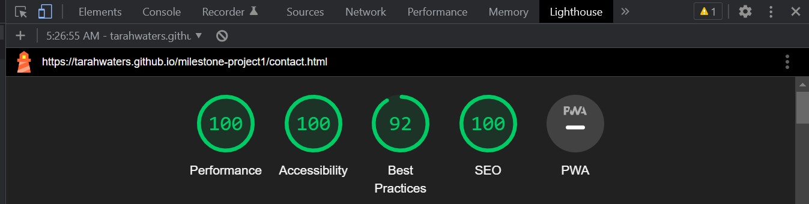
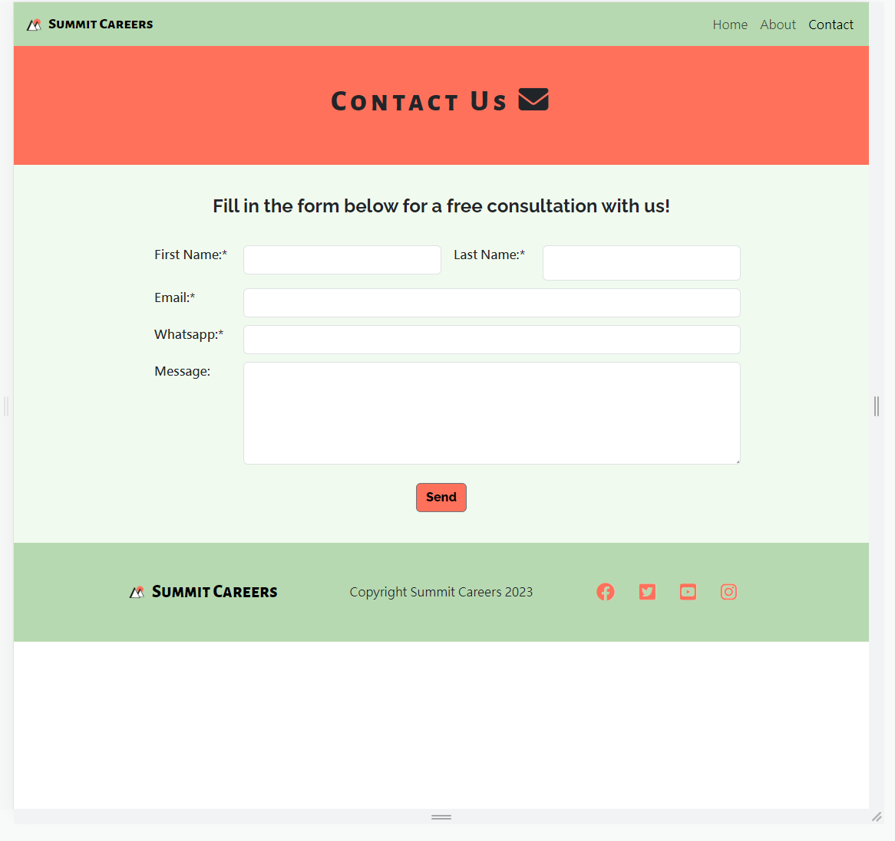

# Testing

Return back to the [README.md](README.md) file.

In this section I will be providing evidence to show that:
- The project **features** work as intended
- The **users** can achieve their goals
- The project is **responsive** across different devices and screen sizes
- The project is **compatible** across different web browsers
- The project uses **valid code** according to standard practice
- The project passes audits for **performance, accessibility, best practices and SEO** (using Lighthouse by Chrome Developer Tools)

## Code Validation

I will use this space to discuss code validation of my code files (where applicable).
I will not validate external libraries/frameworks, such as imported Bootstrap, Materialize, Font Awesome, etc.

### HTML

I have used the recommended [HTML W3C Validator](https://validator.w3.org) to validate all of my HTML files.

I validated each of the live pages using the deployed URL. This gave me a custom URL for each page which I have included in the documentation below. This will make it easier to return to each page when validating again in future.

| Page | W3C URL | Screenshot | Notes |
| --- | --- | --- | --- |
| Home | [W3C](https://validator.w3.org/nu/?doc=https%3A%2F%2Ftarahwaters.github.io%2Fmilestone-project1%2Findex.html) |  | Pass: No Errors |
| About | [W3C](https://validator.w3.org/nu/?doc=https%3A%2F%2Ftarahwaters.github.io%2Fmilestone-project1%2Fabout.html) |  | Pass: No Errors |
| Contact | [W3C](https://validator.w3.org/nu/?doc=https%3A%2F%2Ftarahwaters.github.io%2Fmilestone-project1%2Fcontact.html) |  | Pass: No Errors |
| Redirect (confirmation) | [W3C](https://validator.w3.org/nu/?doc=https%3A%2F%2Ftarahwaters.github.io%2Fmilestone-project1%2Fredirect.html) |  | Pass: No Errors |

### CSS

I have used the recommended [CSS Jigsaw Validator](https://jigsaw.w3.org/css-validator) to validate my CSS file.

The deployed URL was used to validate the CSS since a single file was used for the project. This gave a custom URL which is included and can be used for future validation. Evidence from the direct code input validation was also included.

| File | Jigsaw URL | Screenshot | Notes |
| --- | --- | --- | --- |
| style.css | [Jigsaw - deployed link](https://jigsaw.w3.org/css-validator/validator?uri=https%3A%2F%2Ftarahwaters.github.io%2Fmilestone-project1) |  | The errors shown are from imported Boostrap styling. The warnings are from Bootstrap and also **-webkit-fill-available** is a vendor extension |
| style.css | [Jigsaw - direct input link](https://jigsaw.w3.org/css-validator/#validate_by_input)  |  | Pass: No Errors |

## Browser Compatibility

The live/deployed site was tested on multiple browsers to check for compatibility issues.

The following popular browsers were tested:
- [Chrome](https://www.google.com/chrome)
- [Firefox (Developer Edition)](https://www.mozilla.org/firefox/developer)
- [Edge](https://www.microsoft.com/edge)
- [Safari](https://support.apple.com/downloads/safari)
- [Brave](https://brave.com/download)
- [Opera](https://www.opera.com/download)

| Browser | Screenshot | Notes |
| --- | --- | --- |
| Chrome |  | Works as expected |
| Firefox |  | Works as expected |
| Edge |  | Works as expected |
| Safari |  | Works as expected |
| Brave |  | Works as expected |
| Opera |  | Works as expected |

## Manual Testing

| Feature | Expect | Action | Result |
| --- | --- | --- | --- |
| **Home Navbar Button** | When clicked the Home page will open | Clicked Home on the Nav bar | Home page opened when clicked |
| **About Navbar Button** | When clicked the About page will open | Clicked About on the Nav bar | About page opened when clicked |
| **Contact Navbar Button** | When clicked the Contact page will open | Clicked Contact on the Nav bar | Contact page opened when clicked |
| **Summit logo / Brand name on Navbar** | When clicked the Home page will open | Clicked the logo or brand name on the Nav bar | Home page opened when clicked |
| **Menu Item Button** (screens less than 1400px width) | When clicked the menu item list will open and drop down | Clicked the menu button | Menu list opened |
| **Hero Image Carousel** | Images will automatically scroll across but the user can also click and swipe to the next image | Clicked and swiped the images on the carousel | Carousel changes to the next image in the sequence |
| **'We know what it takes' Link to About Page** | Highlighted text in company-summary section should open the About page | Clicked the 'we know what it takes' text | About page opened when link clicked |
| **'Get in touch' Button Link to Contact Form** | User will be taken to the contact form at the bottom of the page when the button is clicked | Cliked the 'Get in touch' button | Page scrolls down to the contact form or 'Get in touch' section |
| **Form Submit Button** | Form submits and redirects to confirmation page (redirect.html) when required data has been added and submit button is clicked| Clicked the submit button on the form | The form is successfully submitted on click and the user is redirected to a confirmation page |
| **Home Button on Redirect Page** | When clicked the Home page will open | Clicked the Home button on the Redirect page | Home page opened when clicked |
| **Review Carousel Previous / Next image icons** | When clicked the review image and caption will change to the previous / next person | Clicked both the previous and next icons | Review image and caption changed to different person in the carousel |
| **Social Link Icons** | Social link icons open relevant websites in a new tab when clicked | Clicked each social link icon | All links opened a new tabl and to the correct site |

## Responsiveness

I have tested my deployed project on multiple devices to check for responsiveness issues.

| Device | Screenshot | Notes |
| --- | --- | --- |
| **Small Mobile** 320x734 (DevTools) |  | Works as expected |
| **Medium Mobile** 375x374 (iPhone SE using DevTools) |  | Works as expected |
| **Large Mobile** 412x915 (Samsung s20 Ultra) |  | Works as expected |
| **Tablet** 786x734 |  | Works as expected |
| **Laptop** 1024x734 |  | Works as expected   |
| **Large Laptop** 1440x734 |  | Hero-image cover text smaller than expected here but only minor issue |
| **Desktop** 1920x1080 |  | Works as expected |
| **4K Monitor** 2560x1506 |  | Works as expected |

## Lighthouse Audit

I have tested my deployed project using the Lighthouse Audit tool to check for any major issues.

| Page | Size | Screenshot | Notes |
| --- | --- | --- | --- |
| Home | Mobile |  | Some warnings for performance due to sizing of images but also some external code errors that could not be helped |
| Home | Desktop |  | Some warnings for performance due to sizing of images but also some external code errors that could not be helped |
| About | Mobile |  | Some warnings for performance due to sizing of images but also some external code errors that could not be helped |
| About | Desktop |  | Good scores |
| Contact | Mobile |  | Good scores |
| Contact | Desktop |  | Some warnings for performance due to sizing of images but also some external code errors that could not be helped |
| Redirect | Mobile |   | Some warnings for performance due to sizing of images but also some external code errors that could not be helped |
| Redirect | Desktop |   | Some warnings for performance due to sizing of images but also some external code errors that could not be helped |

## User Story Testing

| User Story | Screenshot | Notes |
| --- | --- | --- |
| As a new site user, I would like to find out more about the services offered. |  | A summary of the service the company provides is highlighted on the Home page. |
| As a user I want to find this information easily, without too many clicks needed. |  | Navigation between pages is clear via the navbar menu and a contact form is accessible on each page. |
| As a user I want to know the experience level of the consulting team and their backgrounds.|  | The About page gives details of each team member and their backgrounds. |
| As a user I want to be reassured that the team are trustworthy, have a positive reputation and a track record of successful candidates. |  | 'What are people saying?' section is accessible from the Home page where users can read reviews from previous clients. |
| As a user I want to get in touch with the company easily and securely, without needing to commit or pay anything upfront. |  | There is a contact form accessible at the bottom of each page for easy sign-up. |
| As a user I want to be able to find the company contact details and social links easily. |    | The Contact page is accessible via the navbar menu (as expected) and there are social links in the footer of each page. |
| As a user I want reassurance that my enquiry will be answered quickly and the process is straight-forward. |  | The Redirect page post contact form submission gives the user a time frame of when their enquiry will be answered. |
| As a user I want to the option of opting in / out of receiving newsletters and advice by email when submitting my details. | Unable to achieve at this time - See **Future Features**. | X |
| As a user I want to view this information smoothly on preferably either a mobile device or tablet, with the option of also a desktop. | | The site has a responsive layout accessible from different popular devices and browsers. |
| As a site owner I want users to find out about our services and team |  | There is information about the company and its team acccessible from the Home and About page. |
| As a site owner I want users to submit their contact details and arrange schedule a meeting with us. |   | Contact form is accessible at the bottom of each page as per the client's specifications and the button 'Get in touch' will take the user straight to the form. |
| As a site owner I want users to know the positive success we have had with other clients and the process involved when working with us |  | The Review section of the Home page gives details of positive feedback from other clients, but the Study Abroad page was intended to outline the company's process in more detail (unable to achieve at this time, but a part of **Future Features**.)

## Issues / Bugs

- **Boostrap hero image carousel takes up too much space on large screens** - ✔️ semi-fixed by adjusting the viewport image height in a media query for large screens above 2000px.
- **Horizontal and vertical extra spacing of the page on all devices (excessive margin at bottom and right sides of pages)** - ✅ horizontal spacing fixed by overriding BS gutter via .row class on all pages (credit to @Paul Treggiden for help with this), and vertical spacing fixed by maximising the height of the footer on all pages.
- **Alignment of 'next/previous' carousel indicators on hero and review images** - ✔️ semi-fixed by adding a media query for mobile devices (less than 992px) that overrides the BS class properties for 'align-items' and 'padding-top' so that prev/next indicators are more visible around the review photos. However, this styling then applies to the hero carousel indicators too which makes them less useable (though this is not too problematic for mobile devices, since the buttons are a bit cumbersome anyway).
- **Review captions distort container height and alignment of carousel indicators** - ❌ not yet fixed. Carousel indicators are now separately styled to be located above the review captions, but the caption container adapts in height depending on the content size which is quite jarring for the user on mobile devices.
- **No redirect page after submitting data for contact form** - ✅ redirect.html page created for user confirmation after submitting form data and links added to all contact forms (with button to return to the Home page).
- **University image on homepage stretched on mobile devices** - ✔️ semi-fixed by deleting the CSS media query mistake for .image-sizing up to max-width 1525px. This seemed to work until another bug arose, where there was white spacing under the image for 992px-1450px screen widths. The bug was not fixed, so instead the media query for max-width 992px (i.e. for the single column mobile layout to be activated) was change to 1450px. This means that the single column layout is triggered for larger devices, but at least the image is scaled properly.

- On devices between 480-600px, the hero image cover text is too large and spills out across the page.

    

    - Didn't have time to adjust the media query to fix this but easily fixed if I adjust the font-size and styling of the cover-text box.

- The Contact and Redirect page does not fill the page for medium to large devices.

    
    

    - Need to fix the height of the middle sections relative to the header, footer and heading components but struggled to do this in time. I haven't given specific heights to each section to know how much coverage they have across a page.

- When validating HTML with a semantic `section` element, the validator warns about lacking a header `h2-h6`. This is acceptable.

    - Attempted fix: made sure most headers increased sequentially but there are some that would have affected my original styling too much to fix.

- From 1000-1450px the hero cover text size is smaller then suddenly jumps to being large again.

    
     

    - I suspect this is a media query issue again but didn't have chance to fix it.
